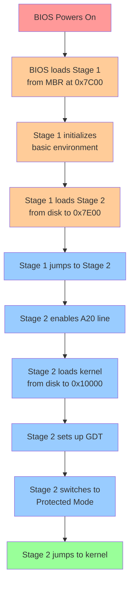

# 🚀 ChanUX Boot System Documentation

## 📋 Overview

ChanUX 운영체제의 부팅 시스템은 2단계 부트로더로 구성되어 있습니다. 이 문서는 boot 디렉터리의 파일들과 부팅 과정을 상세히 설명합니다.

## 📁 Boot Directory Structure

```
boot/
├── stage1.asm     # 1단계 부트로더 (512 bytes)
└── stage2.asm     # 2단계 부트로더 (더 큰 용량)
```

---

## 🔄 Boot Process Flow



---

## 📄 Stage 1 Bootloader (`stage1.asm`)

### 🎯 Primary Functions

| Function | Description | Memory Location |
|----------|-------------|-----------------|
| **Environment Setup** | 세그먼트 레지스터 초기화, 스택 설정 | 0x7C00 |
| **Disk Loading** | Stage 2를 디스크에서 메모리로 로드 | → 0x7E00 |
| **Control Transfer** | Stage 2로 실행 제어권 이전 | Jump to 0x7E00 |

### 🏗️ Memory Layout (Stage 1)

```
Memory Address    Purpose
┌─────────────┬──────────────────────────────┐
│ 0x7C00      │ Stage 1 Bootloader (512B)   │ ← BIOS loads here
├─────────────┼──────────────────────────────┤
│ 0x7E00      │ Stage 2 Target Location     │ ← Stage 1 loads Stage 2 here
├─────────────┼──────────────────────────────┤
│ 0x7BFF ↓    │ Stack (grows downward)      │ ← Stack pointer starts here
└─────────────┴──────────────────────────────┘
```

### 🔧 Key Operations

#### 1. Environment Initialization
```asm
cli                    ; Disable interrupts
xor ax, ax            ; Clear AX register
mov ds, ax            ; Data segment = 0
mov es, ax            ; Extra segment = 0
mov ss, ax            ; Stack segment = 0
mov sp, 0x7C00        ; Stack below bootloader
sti                   ; Re-enable interrupts
```

#### 2. Stage 2 Loading Parameters
```asm
STAGE2_OFFSET equ 0x7E00        ; Target address
STAGE2_SECTORS equ 1            ; Number of sectors
STAGE2_START_SECTOR equ 3       ; Disk sector number
```

#### 3. Boot Signature
```asm
times 510-($-$$) db 0           ; Pad to 510 bytes
dw 0xAA55                       ; Boot signature (required by BIOS)
```

---

## 📄 Stage 2 Bootloader (`stage2.asm`)

### 🎯 Primary Functions

| Function | Description | Memory Range |
|----------|-------------|--------------|
| **A20 Line Enable** | 1MB 이상 메모리 접근 활성화 | System-wide |
| **Kernel Loading** | 커널을 디스크에서 메모리로 로드 | 0x10000 |
| **GDT Setup** | Global Descriptor Table 설정 | Protected Mode |
| **Mode Switch** | 16비트 → 32비트 보호 모드 전환 | System-wide |

### 🏗️ Memory Layout (Stage 2)

```
Memory Address     Purpose                      Size
┌─────────────┬──────────────────────────────┬──────────┐
│ 0x7C00      │ Stage 1 (still in memory)   │ 512B     │
├─────────────┼──────────────────────────────┼──────────┤
│ 0x7E00      │ Stage 2 Bootloader          │ Variable │ ← Current execution
├─────────────┼──────────────────────────────┼──────────┤
│ 0x9000      │ Stack Base (16-bit mode)    │ ↓        │
├─────────────┼──────────────────────────────┼──────────┤
│ 0x10000     │ Kernel Load Target          │ ~49KB    │ ← 97 sectors
├─────────────┼──────────────────────────────┼──────────┤
│ 0x90000     │ 32-bit Stack Base           │ ↓        │
└─────────────┴──────────────────────────────┴──────────┘
```

### 🔧 Key Operations

#### 1. A20 Line Activation
```asm
enable_a20:
    in al, 0x92          ; Read from system control port
    or al, 2             ; Set A20 enable bit
    out 0x92, al         ; Write back to enable A20
    ret
```

#### 2. Kernel Loading Configuration
```asm
KERNEL_OFFSET equ 0x10000       ; 64KB location
KERNEL_SECTORS equ 97           ; 97 * 512 = 49,408 bytes
KERNEL_START_SECTOR equ 11      ; Starts at sector 11
```

#### 3. GDT (Global Descriptor Table)
```
GDT Structure:
┌──────────────┬─────────────────────────────────┐
│ Null Entry   │ Required by x86 architecture    │
├──────────────┼─────────────────────────────────┤
│ Code Segment │ Base:0, Limit:4GB, Execute/Read│
├──────────────┼─────────────────────────────────┤
│ Data Segment │ Base:0, Limit:4GB, Read/Write  │
└──────────────┴─────────────────────────────────┘
```

#### 4. Protected Mode Switch
```asm
switch_to_protected_mode:
    cli                     ; Disable interrupts
    lgdt [gdt_descriptor]   ; Load GDT
    mov eax, cr0            ; Get control register 0
    or al, 1               ; Set Protection Enable bit
    mov cr0, eax           ; Enter protected mode
    jmp CODE_SEG:init_pm   ; Far jump to flush pipeline
```

---

## 💾 Disk Layout

```
Sector 0:     MBR / Stage 1 Bootloader (512 bytes)
Sector 1-2:   (Reserved/Unused)
Sector 3:     Stage 2 Bootloader starts here
Sector 4-10:  Stage 2 Bootloader continues
Sector 11+:   Kernel binary starts here (97 sectors max)
```

---

## 🏃‍♂️ Execution Flow Details

### Phase 1: BIOS → Stage 1
1. **BIOS POST** - Power-On Self Test
2. **Boot Device Selection** - BIOS finds bootable device
3. **MBR Loading** - Loads first 512 bytes to `0x7C00`
4. **Boot Signature Check** - Verifies `0xAA55` signature
5. **Jump to Stage 1** - `jmp 0x7C00`

### Phase 2: Stage 1 → Stage 2
1. **Segment Setup** - Initialize DS, ES, SS registers
2. **Stack Setup** - Configure stack below bootloader
3. **Disk Read** - Load Stage 2 from sector 3
4. **Error Handling** - Display error if disk read fails
5. **Transfer Control** - `jmp 0x7E00`

### Phase 3: Stage 2 → Kernel
1. **A20 Enable** - Access memory above 1MB
2. **Kernel Load** - Read 97 sectors to `0x10000`
3. **GDT Setup** - Prepare segment descriptors
4. **Mode Switch** - Enter 32-bit protected mode
5. **Kernel Jump** - `jmp 0x10000`

---

## 🛠️ Build Process

The bootloader is built using the Makefile:

```bash
# Assemble Stage 1
nasm -f bin boot/stage1.asm -o build/stage1.bin

# Assemble Stage 2  
nasm -f bin boot/stage2.asm -o build/stage2.bin

# Create disk image and copy bootloaders
./create_hdd.sh
```

---

## 🚨 Error Handling

### Stage 1 Errors
- **Disk Read Error**: Displays "Disk Error!" and halts system
- **No Stage 2**: System hangs if Stage 2 not found

### Stage 2 Errors  
- **Kernel Load Error**: Displays error message and halts
- **A20 Failure**: May cause memory access issues
- **GDT Error**: System crash in protected mode

---

## 🎛️ Configuration Constants

| Constant | Value | Purpose |
|----------|-------|---------|
| `STAGE2_OFFSET` | 0x7E00 | Stage 2 load address |
| `STAGE2_SECTORS` | 1 | Stage 2 size in sectors |
| `KERNEL_OFFSET` | 0x10000 | Kernel load address (64KB) |
| `KERNEL_SECTORS` | 97 | Maximum kernel size (49KB) |
| `STAGE2_START_SECTOR` | 3 | Stage 2 disk location |
| `KERNEL_START_SECTOR` | 11 | Kernel disk location |

---

## 🔍 Debugging Tips

1. **VGA Direct Write**: Stage 2 writes directly to `0xB8000` for immediate visual feedback
2. **BIOS Messages**: Both stages use BIOS interrupt `0x10` for text output
3. **Register Preservation**: Critical registers (boot drive) are saved across stages
4. **Stack Safety**: Different stack locations for 16-bit and 32-bit modes

---

## 📚 Technical References

- **x86 Real Mode**: 16-bit addressing, BIOS services available
- **Protected Mode**: 32-bit addressing, GDT required, no BIOS
- **A20 Line**: Gate that enables access to memory above 1MB
- **MBR**: Master Boot Record, first 512 bytes of bootable disk
- **BIOS Interrupts**: INT 0x10 (video), INT 0x13 (disk)

---

*This documentation covers the complete boot system for ChanUX operating system. The two-stage bootloader provides a robust foundation for loading and starting the kernel in protected mode.*
