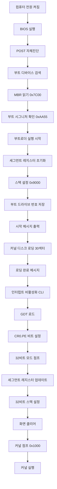

# 부트로더 실행 과정 시각화

## 🚀 부트로더 실행 순서도



## 🧠 메모리 상태 변화

### 초기 상태 (BIOS 로딩 직후)
```
0x7C00: [부트로더 코드 512바이트]
0x7E00: [사용 가능한 메모리]
```

### 커널 로딩 후
```
0x7C00: [부트로더 코드]
0x1000: [커널 코드 15KB]
0x9000: [스택 영역] ← SP, BP
```

### 32비트 모드 전환 후
```
0x7C00: [부트로더 코드]
0x1000: [커널 코드]
0x90000: [32비트 스택] ← ESP, EBP
0xB8000: [VGA 텍스트 메모리]
```

## 📊 레지스터 상태 추적

### 16비트 모드 초기화
```assembly
; 세그먼트 레지스터 설정
DS = 0x0000  ; 데이터 세그먼트
ES = 0x0000  ; 확장 세그먼트
SS = 0x0000  ; 스택 세그먼트 (암시적)

; 스택 포인터 설정
BP = 0x9000  ; 스택 기준점
SP = 0x9000  ; 스택 포인터 (빈 스택)

; 부트 정보
DL = 0x80    ; 부트 드라이브 (첫번째 하드디스크)
```

### 커널 로딩 시 BIOS 파라미터
```assembly
; INT 0x13 디스크 읽기 서비스
AH = 0x02    ; 읽기 기능
AL = 30      ; 섹터 수
CH = 0       ; 실린더
CL = 2       ; 시작 섹터 (2번부터)
DH = 0       ; 헤드
DL = 0x80    ; 드라이브
ES:BX = 0x0000:0x1000  ; 목표 주소
```

### 32비트 모드 전환
```assembly
; CR0 레지스터 수정
CR0 = CR0 | 1  ; PE 비트 설정

; 세그먼트 셀렉터 로드
CS = 0x08    ; 코드 세그먼트 (CODE_SEG)
DS = 0x10    ; 데이터 세그먼트 (DATA_SEG)
SS = 0x10    ; 스택 세그먼트
ES = 0x10    ; 확장 세그먼트
FS = 0x10    ; 추가 세그먼트
GS = 0x10    ; 추가 세그먼트

; 32비트 스택 설정
EBP = 0x90000  ; 새로운 스택 기준점
ESP = 0x90000  ; 새로운 스택 포인터
```

## 🔧 GDT 구조 상세

### GDT 테이블 레이아웃
```
오프셋  엔트리        크기    설명
0x00    NULL         8바이트  필수 NULL 엔트리
0x08    CODE_SEG     8바이트  코드 세그먼트
0x10    DATA_SEG     8바이트  데이터 세그먼트
```

### 디스크립터 비트 구조
```
세그먼트 디스크립터 (8바이트 = 64비트)

Byte 7: Base[31:24]
Byte 6: G|D/B|L|AVL|Limit[19:16]
Byte 5: P|DPL[1:0]|S|Type[3:0]
Byte 4: Base[23:16]
Byte 3: Base[15:8]
Byte 2: Base[7:0]
Byte 1: Limit[15:8]
Byte 0: Limit[7:0]
```

### Access Byte 상세
```
코드 세그먼트: 10011010b
├─ P=1:    Present (메모리에 존재)
├─ DPL=00: 커널 권한 레벨
├─ S=1:    코드/데이터 세그먼트
├─ E=1:    실행 가능
├─ C=0:    비준수 (Conforming=0)
├─ R=1:    읽기 가능
└─ A=0:    Accessed (초기값)

데이터 세그먼트: 10010010b
├─ P=1:    Present (메모리에 존재)
├─ DPL=00: 커널 권한 레벨
├─ S=1:    코드/데이터 세그먼트
├─ E=0:    실행 불가능
├─ ED=0:   확장 방향 위쪽
├─ W=1:    쓰기 가능
└─ A=0:    Accessed (초기값)
```

## ⚡ 중요한 시점들

### 🔴 Critical Section: 모드 전환
```assembly
cli                    ; 🚨 인터럽트 비활성화 시작
lgdt [gdt_descriptor] ; GDT 로드
mov eax, cr0          ; CR0 읽기
or al, 1              ; PE 비트 설정
mov cr0, eax          ; 🎯 보호 모드 활성화!
jmp CODE_SEG:init_pm  ; 파이프라인 플러시
; 🟢 안전 구간: 32비트 모드
```

### 📡 BIOS 서비스 사용 가능 구간
```
16비트 모드: ✅ BIOS 서비스 사용 가능
  - INT 0x10: 비디오 서비스
  - INT 0x13: 디스크 서비스
  - INT 0x16: 키보드 서비스

32비트 모드: ❌ BIOS 서비스 사용 불가
  - 직접 하드웨어 제어 필요
  - VGA 메모리 직접 접근
  - 포트 I/O 사용
```

## 🐛 일반적인 문제와 해결법

### 문제 1: 무한 재부팅
```
원인: 부트 시그니처 누락
해결: times 510-($-$$) db 0
      dw 0xAA55
```

### 문제 2: 커널 로드 실패
```
원인: 잘못된 디스크 파라미터
확인사항:
- 섹터 수 (DH): 커널 크기에 맞게
- 시작 섹터 (CL): 2번부터 시작
- 드라이브 번호 (DL): 올바른 값
```

### 문제 3: 보호 모드 전환 실패
```
원인: GDT 설정 오류
확인사항:
- NULL 디스크립터 존재
- 올바른 Access Byte
- 정확한 셀렉터 값
```

## 🔍 디버깅 팁

### 1. 메시지를 통한 진행 상황 추적
```assembly
; 각 단계마다 메시지 출력
mov si, MSG_STEP1
call print_string
; ... 작업 수행 ...
mov si, MSG_STEP2
call print_string
```

### 2. 레지스터 값 출력
```assembly
; 레지스터 값을 16진수로 출력
mov dh, al        ; 확인하고 싶은 값을 DH에
call print_hex    ; 화면에 16진수로 출력
```

### 3. VGA 메모리 직접 확인
```assembly
; 32비트 모드에서 특정 위치에 문자 출력
mov dword [0xb8000], 0x4F414F42  ; "BOBA" 출력
```

### 4. QEMU 디버깅
```bash
# 디버그 모드로 QEMU 실행
qemu-system-i386 -drive format=raw,file=hard-disk.img -monitor stdio

# GDB와 연결
qemu-system-i386 -s -S -drive format=raw,file=hard-disk.img
gdb
(gdb) target remote localhost:1234
(gdb) set architecture i8086
(gdb) break *0x7c00
(gdb) continue
```

이제 부트로더 코드의 모든 라인이 상세한 주석과 함께 설명되었고, 시각적 가이드도 제공되었습니다. 이를 통해 부트로더의 작동 원리를 단계별로 이해할 수 있을 것입니다!
