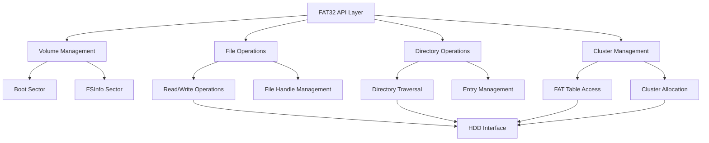
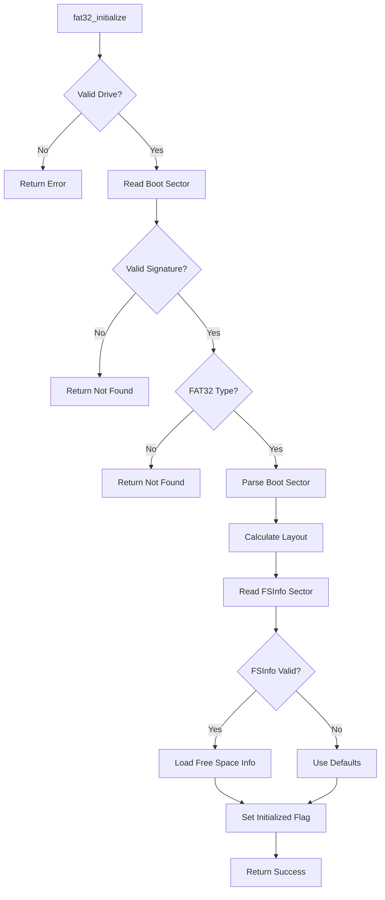
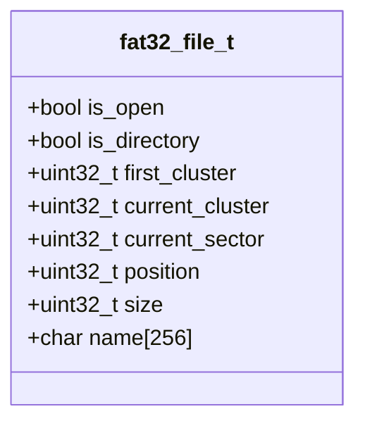
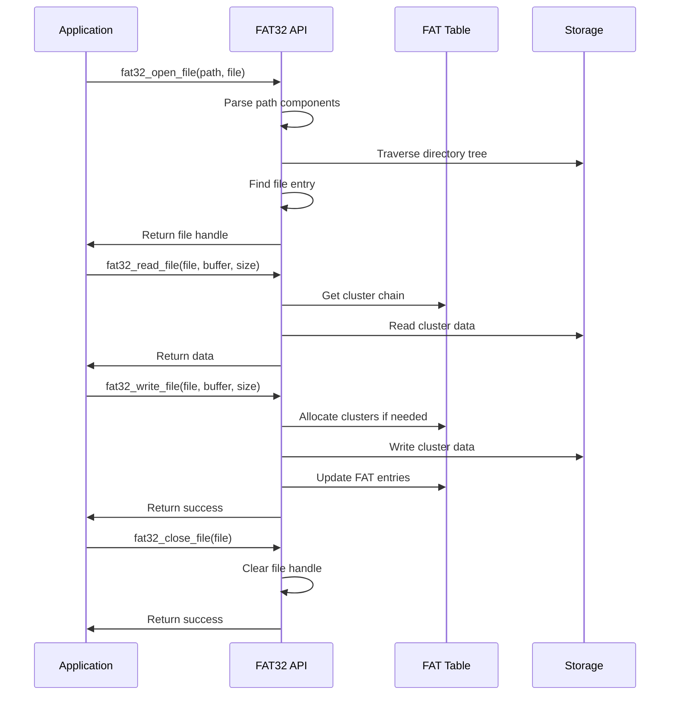
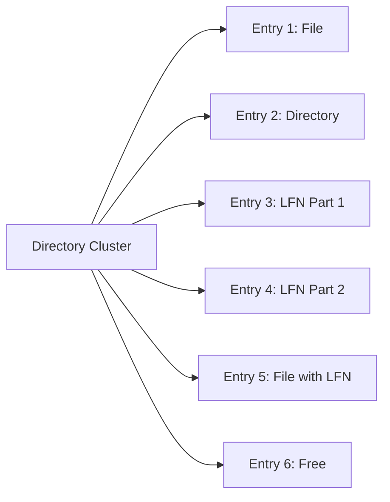
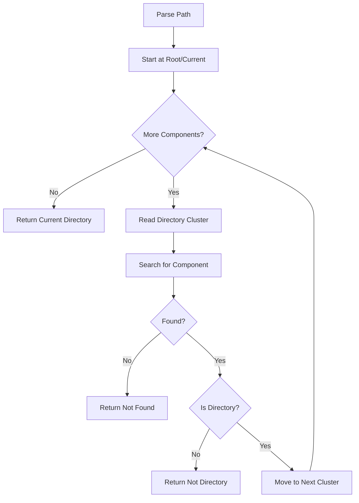
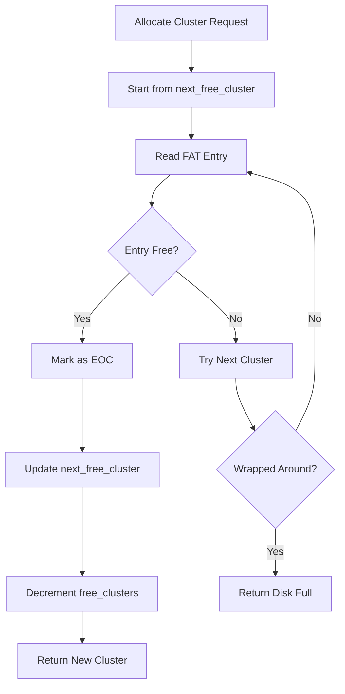
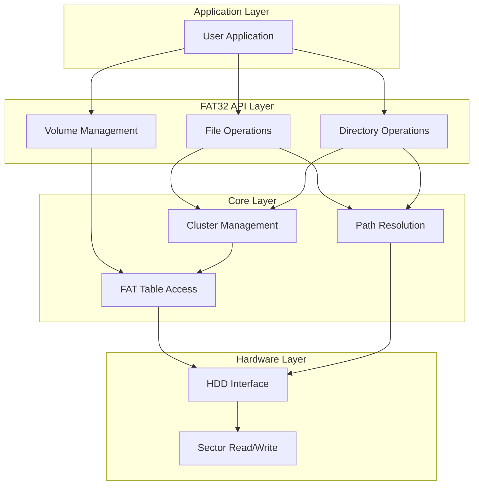
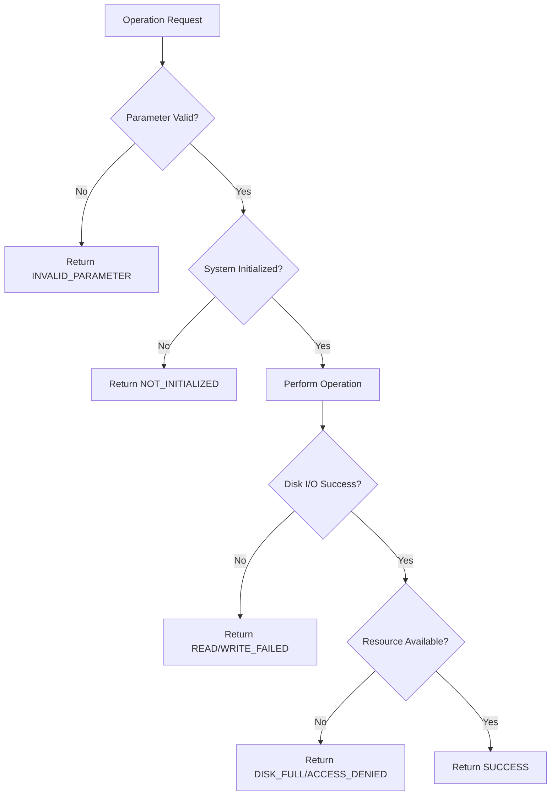

# FAT32 File System Documentation

## Table of Contents
1. [Overview](#overview)
2. [Data Structures](#data-structures)
3. [Initialization & Volume Management](#initialization--volume-management)
4. [File Operations](#file-operations)
5. [Directory Operations](#directory-operations)
6. [Cluster Management](#cluster-management)
7. [Memory Layout](#memory-layout)
8. [System Flow](#system-flow)

## Overview

The FAT32 file system implementation in ChanUX provides a complete solution for managing files and directories on storage devices. FAT32 (File Allocation Table 32-bit) is a widely-used file system that organizes data using a file allocation table and supports large storage devices with efficient space utilization.

### Key Features
- **Full FAT32 compliance** with proper boot sector and FSInfo handling
- **Complete file operations**: create, read, write, delete, rename
- **Directory management**: create, delete, navigate directories
- **Cluster allocation**: efficient space management with free cluster tracking
- **Path parsing**: supports both absolute and relative paths
- **Error handling**: comprehensive error reporting and recovery

### Architecture Components


## Data Structures

### Boot Sector Structure
The FAT32 boot sector contains critical file system metadata:

```c
typedef struct {
    uint8_t     jump_boot[3];         // Jump instruction to boot code
    char        oem_name[8];          // OEM Name identifier
    uint16_t    bytes_per_sector;     // Bytes per sector (512)
    uint8_t     sectors_per_cluster;  // Sectors per cluster
    uint16_t    reserved_sectors;     // Reserved sectors count
    uint8_t     num_fats;             // Number of FAT copies
    uint16_t    root_entry_count;     // Root entries (0 for FAT32)
    uint16_t    total_sectors_16;     // Total sectors (0 for FAT32)
    uint8_t     media_type;           // Media descriptor
    uint16_t    sectors_per_fat_16;   // Sectors per FAT (0 for FAT32)
    uint16_t    sectors_per_track;    // Track geometry
    uint16_t    num_heads;            // Head geometry
    uint32_t    hidden_sectors;       // Hidden sectors
    uint32_t    total_sectors_32;     // Total sectors (FAT32)
    uint32_t    sectors_per_fat_32;   // Sectors per FAT
    uint16_t    ext_flags;            // Extended flags
    uint16_t    fs_version;           // File system version
    uint32_t    root_cluster;         // Root directory cluster
    uint16_t    fs_info;              // FSInfo sector number
    uint16_t    backup_boot;          // Backup boot sector
    uint8_t     reserved[12];         // Reserved space
    uint8_t     drive_number;         // Drive number
    uint8_t     reserved1;            // Reserved
    uint8_t     boot_signature;       // Boot signature (0x29)
    uint32_t    volume_id;            // Volume serial number
    char        volume_label[11];     // Volume label
    char        fs_type[8];           // "FAT32   "
} __attribute__((packed)) fat32_boot_sector_t;
```

### Directory Entry Structure
Standard FAT32 directory entries store file/directory metadata:

```c
typedef struct {
    char        name[8];              // Base filename (8 chars)
    char        ext[3];               // Extension (3 chars)
    uint8_t     attributes;           // File attributes
    uint8_t     reserved;             // Reserved (Windows NT)
    uint8_t     creation_time_tenth;  // Creation time fraction
    uint16_t    creation_time;        // Creation time
    uint16_t    creation_date;        // Creation date
    uint16_t    last_access_date;     // Last access date
    uint16_t    first_cluster_high;   // High 16 bits of first cluster
    uint16_t    last_modify_time;     // Last modification time
    uint16_t    last_modify_date;     // Last modification date
    uint16_t    first_cluster_low;    // Low 16 bits of first cluster
    uint32_t    file_size;            // File size in bytes
} __attribute__((packed)) fat32_dir_entry_t;
```

### Volume Information Structure
Runtime volume state and metadata:

```c
typedef struct {
    uint8_t         drive;                   // Drive number
    bool            initialized;             // Initialization status
    uint32_t        total_sectors;           // Total sectors on volume
    uint32_t        fat_begin_lba;           // First FAT sector
    uint32_t        cluster_begin_lba;       // First data cluster sector
    uint32_t        root_dir_first_cluster;  // Root directory cluster
    uint32_t        data_sectors;            // Data area sectors
    uint32_t        total_clusters;          // Total available clusters
    uint32_t        free_clusters;           // Free clusters count
    uint32_t        next_free_cluster;       // Next free cluster hint
    uint8_t         sectors_per_cluster;     // Cluster size
    uint32_t        fat_size;                // FAT size in sectors
    uint8_t         num_fats;                // Number of FAT copies
    char            volume_label[12];        // Volume label
    uint16_t        bytes_per_sector;        // Sector size
    fat32_boot_sector_t boot_sector;         // Boot sector data
} fat32_volume_t;
```

## Initialization & Volume Management

### Volume Initialization Process



### Key Initialization Functions

**`fat32_initialize(uint8_t drive)`**
- Validates drive parameter and reads boot sector
- Verifies FAT32 signature and file system type
- Calculates critical layout information (FAT location, cluster area)
- Loads FSInfo sector for free space tracking
- Sets up global volume state

**Layout Calculations:**
```c
// FAT starts after reserved sectors
fat32_volume.fat_begin_lba = fat32_volume.boot_sector.reserved_sectors;

// Data clusters start after all FATs
fat32_volume.cluster_begin_lba = fat32_volume.fat_begin_lba + 
                                (fat32_volume.num_fats * fat32_volume.fat_size);

// Total data clusters
fat32_volume.total_clusters = fat32_volume.data_sectors / fat32_volume.sectors_per_cluster;
```

### Drive Formatting

The `fat32_format_drive()` function creates a complete FAT32 file system:

1. **Boot Sector Creation**: Fills in all BPB fields with calculated values
2. **FSInfo Sector**: Creates file system information sector
3. **FAT Initialization**: Creates and duplicates FAT tables
4. **Root Directory**: Creates empty root directory cluster

## File Operations

### File Handle Management



### File Operation Flow



### Key File Functions

**File Opening**: `fat32_open_file(const char* path, fat32_file_t* file)`
- Parses path into components using 8.3 naming
- Traverses directory tree to locate file
- Initializes file handle with cluster information

**File Reading**: `fat32_read_file(fat32_file_t* file, void* buffer, uint32_t size, uint32_t* bytes_read)`
- Reads data following cluster chain
- Handles cluster boundaries automatically
- Updates file position and current cluster

**File Writing**: `fat32_write_file(fat32_file_t* file, const void* buffer, uint32_t size, uint32_t* bytes_written)`
- Allocates new clusters as needed
- Updates file size in directory entry
- Maintains cluster chain integrity

## Directory Operations

### Directory Structure

FAT32 directories are implemented as files containing directory entries. Each entry is 32 bytes and can represent either a standard file/directory or part of a long filename sequence.



### Directory Navigation



### Key Directory Functions

**Directory Opening**: `fat32_open_directory(const char* path, fat32_file_t* dir)`
- Supports both absolute and relative paths
- Special handling for root directory
- Returns directory handle for iteration

**Directory Creation**: `fat32_create_directory(const char* path)`
- Allocates new cluster for directory
- Creates "." and ".." entries
- Updates parent directory with new entry

**Directory Reading**: `fat32_read_directory(fat32_file_t* dir, fat32_dir_entry_t* entry, char* long_name)`
- Iterates through directory entries
- Skips deleted and LFN entries
- Converts 8.3 names to readable format

## Cluster Management

### Cluster Allocation Strategy



### FAT Table Management

The File Allocation Table tracks cluster usage and links:

- **Free Cluster**: 0x00000000
- **Reserved**: 0x00000001
- **Used Cluster**: Points to next cluster or EOC
- **End of Chain**: 0x0FFFFFF8 - 0x0FFFFFFF
- **Bad Cluster**: 0x0FFFFFF7

### Key Cluster Functions

**Cluster Reading**: `fat32_read_cluster(uint32_t cluster, uint8_t* buffer)`
```c
uint32_t lba = fat32_cluster_to_lba(cluster);
for (uint8_t i = 0; i < fat32_volume.sectors_per_cluster; i++) {
    hdd_read_sector(fat32_volume.drive, lba + i, 
                   buffer + (i * fat32_volume.bytes_per_sector));
}
```

**Cluster Chain Following**: `fat32_get_next_cluster(uint32_t cluster)`
```c
uint32_t fat_offset = cluster * 4;  // 4 bytes per FAT32 entry
uint32_t fat_sector = fat32_volume.fat_begin_lba + (fat_offset / FAT32_SECTOR_SIZE);
uint32_t ent_offset = fat_offset % FAT32_SECTOR_SIZE;
// Read FAT sector and extract cluster value
```

## Memory Layout

### Disk Layout Structure

```
┌─────────────────┬─────────────────┬─────────────────┬─────────────────┐
│   Boot Sector   │  Reserved Area  │   FAT Tables    │   Data Clusters │
│                 │                 │                 │                 │
│ Sector 0        │ Sectors 1-31    │ Sectors 32+     │ Sectors X+      │
│ (FAT32 info)    │ (FSInfo, etc.)  │ (2 copies)      │ (Files/Dirs)    │
└─────────────────┴─────────────────┴─────────────────┴─────────────────┘
```

### Cluster Address Calculation


**Formula**: `LBA = cluster_begin_lba + ((cluster - 2) * sectors_per_cluster)`

### Memory Buffer Management

The implementation uses several static buffers for efficient operation:
- **Sector Buffer**: 512 bytes for FAT operations
- **Cluster Buffer**: Up to 4KB for cluster operations
- **Path Components**: Support for 16-level deep paths

## System Flow

### Complete File System Operation Flow



### Error Handling Strategy

The FAT32 implementation provides comprehensive error handling:



### Performance Optimizations

1. **Free Cluster Hinting**: Maintains `next_free_cluster` to reduce search time
2. **Sector Buffering**: Caches frequently accessed FAT sectors
3. **Cluster Validation**: Range checks prevent invalid disk access
4. **Multiple FAT Copies**: Ensures data integrity with redundant FATs

This FAT32 implementation provides a robust, feature-complete file system suitable for embedded operating systems while maintaining compatibility with standard FAT32 specifications.