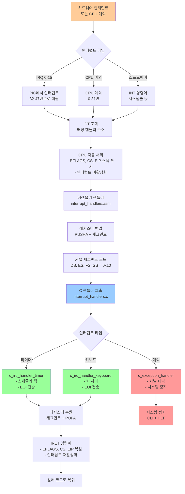
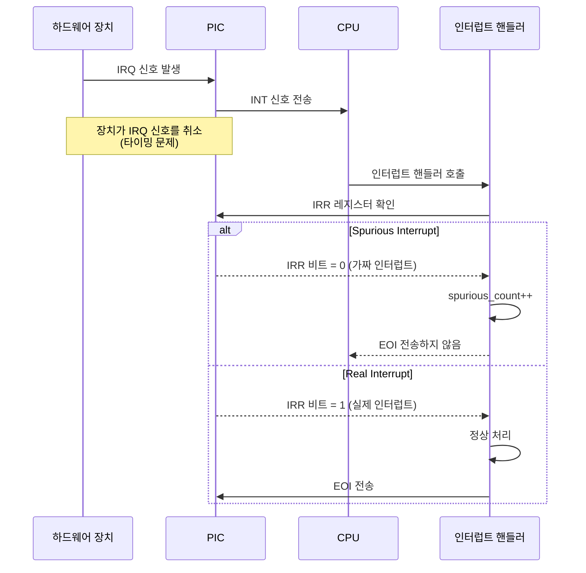

# ⚡ ChanUX Interrupt Management System Documentation

## 📋 Overview

ChanUX 인터럽트 관리 시스템은 하드웨어와 소프트웨어 인터럽트를 효율적으로 처리하여 시스템의 반응성과 안정성을 보장합니다. 이 문서는 IDT, PIC, 예외 처리, IRQ 핸들링의 구조와 동작을 상세히 설명합니다.

## 📁 Interrupt System Structure

```
kernel/src/interrupts/
├── idt.c                    # IDT 및 PIC 초기화
├── interrupt_handlers.asm   # 저수준 인터럽트 핸들러
├── interrupt_handlers.c     # 고수준 인터럽트 처리
└── interrupts.h            # 인터럽트 시스템 인터페이스
```

---

## 🔄 Interrupt Processing Flow



---

## 📄 Interrupt Descriptor Table (IDT)

### 🎯 IDT Structure

```c
typedef struct {
    uint16_t offset_low;    // 핸들러 주소 하위 16비트
    uint16_t selector;      // 코드 세그먼트 셀렉터 (0x08)
    uint8_t  zero;          // 예약됨 (0)
    uint8_t  type_attr;     // 타입과 속성 플래그
    uint16_t offset_high;   // 핸들러 주소 상위 16비트
} __attribute__((packed)) idt_entry_t;
```

### 🏗️ IDT Layout

```
IDT (256 entries × 8 bytes = 2KB):
┌─────────────┬──────────────────────────────────────┬─────────────┐
│ Entry 0-31  │ CPU 예외 (Exception Handlers)        │ 예외 처리   │
│             │ ├─ 0: Division by Zero               │             │
│             │ ├─ 1: Debug                          │             │
│             │ ├─ 6: Invalid Opcode                 │             │
│             │ ├─ 13: General Protection Fault      │             │
│             │ └─ 14: Page Fault                    │             │
├─────────────┼──────────────────────────────────────┼─────────────┤
│ Entry 32-47 │ 하드웨어 인터럽트 (IRQ 0-15)         │ 장치 제어   │
│             │ ├─ 32: Timer (IRQ 0)                │             │
│             │ ├─ 33: Keyboard (IRQ 1)             │             │
│             │ ├─ 34: Cascade (IRQ 2)              │             │
│             │ └─ 35-47: 기타 하드웨어             │             │
├─────────────┼──────────────────────────────────────┼─────────────┤
│ Entry 48-127│ 시스템콜 및 사용자 정의 인터럽트      │ 확장 가능   │
├─────────────┼──────────────────────────────────────┼─────────────┤
│ Entry 128-255│ 예약됨 (향후 확장용)               │ 미사용      │
└─────────────┴──────────────────────────────────────┴─────────────┘
```

### 🔧 IDT Initialization

```c
void interrupts_initialize(void) {
    // IDT 클리어
    memset(&idt, 0, sizeof(idt));
    
    // CPU 예외 핸들러 설정 (0-19)
    idt_set_gate(0, exception_handler_0, 0x08, IDT_TYPE_INTERRUPT_GATE);
    idt_set_gate(13, exception_handler_13, 0x08, IDT_TYPE_INTERRUPT_GATE);
    idt_set_gate(14, exception_handler_14, 0x08, IDT_TYPE_INTERRUPT_GATE);
    
    // 하드웨어 인터럽트 핸들러 설정 (32+)
    idt_set_gate(32, irq_handler_timer, 0x08, IDT_TYPE_INTERRUPT_GATE);
    idt_set_gate(33, irq_handler_keyboard, 0x08, IDT_TYPE_INTERRUPT_GATE);
    
    // IDT 로드
    idt_load();
    pic_initialize();
}
```

---

## 📄 Programmable Interrupt Controller (PIC)

### 🎯 PIC Configuration

| 구성 요소 | Master PIC (8259A) | Slave PIC (8259A) |
|-----------|-------------------|-------------------|
| **포트 주소** | 0x20 (Command), 0x21 (Data) | 0xA0 (Command), 0xA1 (Data) |
| **IRQ 범위** | IRQ 0-7 | IRQ 8-15 |
| **인터럽트 번호** | INT 32-39 | INT 40-47 |
| **계단식 연결** | IRQ 2로 Slave PIC 연결 | Master PIC에 종속 |

### 🏗️ PIC Cascade Configuration

```
PIC 계단식 구조:
┌─────────────────────────────────────────────┐
│ Master PIC (8259A)                          │
│ ┌─────────┬─────────────────────────────────┤
│ │ IRQ 0   │ Timer (PIT)                     │ → INT 32
│ │ IRQ 1   │ Keyboard                        │ → INT 33
│ │ IRQ 2   │ Cascade (Slave PIC 연결)        │ → 계단식
│ │ IRQ 3   │ COM2/COM4                       │ → INT 35
│ │ IRQ 4   │ COM1/COM3                       │ → INT 36
│ │ IRQ 5   │ LPT2/Sound Card                 │ → INT 37
│ │ IRQ 6   │ Floppy Disk                     │ → INT 38
│ │ IRQ 7   │ LPT1 (Spurious 가능)            │ → INT 39
│ └─────────┴─────────────────────────────────┤
├─────────────────────────────────────────────┤
│ Slave PIC (8259A)                           │
│ ┌─────────┬─────────────────────────────────┤
│ │ IRQ 8   │ RTC (Real Time Clock)           │ → INT 40
│ │ IRQ 9   │ ACPI/Legacy SCSI/NIC            │ → INT 41
│ │ IRQ 10  │ 사용 가능                        │ → INT 42
│ │ IRQ 11  │ 사용 가능                        │ → INT 43
│ │ IRQ 12  │ PS/2 Mouse                      │ → INT 44
│ │ IRQ 13  │ FPU/Coprocessor                 │ → INT 45
│ │ IRQ 14  │ IDE Primary                     │ → INT 46
│ │ IRQ 15  │ IDE Secondary (Spurious 가능)   │ → INT 47
│ └─────────┴─────────────────────────────────┘
└─────────────────────────────────────────────┘
```

### 🔧 PIC Initialization Process

```c
void pic_initialize(void) {
    // ICW1: 초기화 시작 (계단식 모드, ICW4 필요)
    outb(PIC1_COMMAND, ICW1_INIT | ICW1_ICW4);
    outb(PIC2_COMMAND, ICW1_INIT | ICW1_ICW4);
    
    // ICW2: 인터럽트 벡터 오프셋 설정
    outb(PIC1_DATA, 32);    // Master: IRQ 0-7 → INT 32-39
    outb(PIC2_DATA, 40);    // Slave: IRQ 8-15 → INT 40-47
    
    // ICW3: 계단식 연결 설정
    outb(PIC1_DATA, 4);     // Master: IRQ 2에 Slave 연결
    outb(PIC2_DATA, 2);     // Slave: 계단식 ID = 2
    
    // ICW4: 8086 모드 설정
    outb(PIC1_DATA, ICW4_8086);
    outb(PIC2_DATA, ICW4_8086);
    
    // 인터럽트 마스크 설정
    outb(PIC1_DATA, 0xF8);  // IRQ 0,1,2만 활성화
    outb(PIC2_DATA, 0xFF);  // Slave 모든 IRQ 비활성화
}
```

---

## 📄 Assembly Interrupt Handlers

### 🎯 Handler Macros

#### IRQ Handler Macro
```asm
%macro IRQ_HANDLER_COMMON 1
    pusha              ; 모든 범용 레지스터 저장
    
    ; 세그먼트 레지스터 저장
    mov ax, ds
    push eax
    mov ax, es  
    push eax
    
    ; 커널 데이터 세그먼트 로드
    mov ax, 0x10
    mov ds, ax
    mov es, ax
    
    ; C 핸들러 호출
    call %1
    
    ; 세그먼트 레지스터 복원
    pop eax
    mov es, ax
    pop eax
    mov ds, ax
    
    popa               ; 범용 레지스터 복원
    iret               ; 인터럽트에서 복귀
%endmacro
```

#### Exception Handler Macro
```asm
%macro EXCEPTION_HANDLER 2
exception_handler_%1:
    %if %2 == 0
        push 0         ; 더미 에러 코드 (예외에 따라)
    %endif
    push %1            ; 예외 번호 푸시
    jmp exception_handler_common
%endmacro
```

### 🏗️ Stack Layout During Interrupt

```
인터럽트 처리 중 스택 구조:
┌─────────────────────────────────────────┐ ← 높은 주소
│ User SS (권한 변경 시에만)               │
│ User ESP (권한 변경 시에만)              │
├─────────────────────────────────────────┤
│ EFLAGS (CPU 자동 푸시)                  │ ← CPU 자동 저장
│ CS (CPU 자동 푸시)                      │
│ EIP (CPU 자동 푸시)                     │
├─────────────────────────────────────────┤
│ Error Code (예외에 따라)                │ ← 일부 예외만
│ Exception Number (예외 핸들러)          │ ← 어셈블리 핸들러 추가
├─────────────────────────────────────────┤
│ GS (어셈블리 핸들러 저장)               │ ← 어셈블리 핸들러 저장
│ FS                                      │
│ ES                                      │
│ DS                                      │
├─────────────────────────────────────────┤
│ EDI (PUSHA로 저장)                      │ ← PUSHA 명령어로 저장
│ ESI                                     │
│ EBP                                     │
│ ESP (원본)                              │
│ EBX                                     │
│ EDX                                     │
│ ECX                                     │
│ EAX                                     │ ← 현재 ESP 위치
└─────────────────────────────────────────┘ ← 낮은 주소
```

---

## 📄 C Interrupt Handlers

### 🎯 Timer Interrupt Handler

```c
void c_irq_handler_timer(void) {
    // Spurious 인터럽트 검사
    if (is_spurious_irq(32)) {
        spurious_interrupt_count++;
        return;
    }
    
    // 통계 업데이트
    timer_interrupt_count++;
    
    // 타이머 틱 처리 (스케줄러 호출 포함)
    timer_tick();
    
    // PIC에 EOI 신호 전송
    send_eoi(32);
}
```

### 🎯 Keyboard Interrupt Handler

```c
void c_irq_handler_keyboard(void) {
    // Spurious 인터럽트 검사
    if (is_spurious_irq(33)) {
        spurious_interrupt_count++;
        return;
    }
    
    // 통계 업데이트
    keyboard_interrupt_count++;
    
    // 키보드 입력 처리
    keyboard_handler();
    
    // PIC에 EOI 신호 전송
    send_eoi(33);
}
```

### 🎯 Exception Handler

```c
void c_exception_handler(void* context) {
    exception_context_t* ctx = (exception_context_t*)context;
    
    // 인터럽트 비활성화
    disable_interrupts();
    
    // 화면 클리어 및 커널 패닉 메시지
    terminal_clear();
    terminal_setcolor(VGA_COLOR_WHITE, VGA_COLOR_RED);
    
    // 예외 정보 출력
    terminal_writestring("=== KERNEL PANIC: CPU EXCEPTION ===\n");
    terminal_writestring("Exception: ");
    terminal_writeline(exception_names[ctx->exception_num]);
    
    // 레지스터 덤프
    display_registers(ctx);
    
    // 페이지 폴트 상세 정보 (예외 14)
    if (ctx->exception_num == 14) {
        display_page_fault_info(ctx);
    }
    
    // 시스템 정지
    halt_system();
}
```

---

## ⚡ Interrupt Types & Handling

### CPU Exceptions (0-31)

| 번호 | 이름 | 에러코드 | 설명 | 처리 방식 |
|------|------|----------|------|-----------|
| **0** | Division by Zero | ❌ | 0으로 나누기 | 커널 패닉 |
| **1** | Debug | ❌ | 디버그 예외 | 디버거 호출 |
| **3** | Breakpoint | ❌ | INT3 명령어 | 트랩 게이트 |
| **6** | Invalid Opcode | ❌ | 잘못된 명령어 | 커널 패닉 |
| **8** | Double Fault | ✅ | 이중 폴트 | 커널 패닉 |
| **13** | General Protection | ✅ | 보호 위반 | 커널 패닉 |
| **14** | Page Fault | ✅ | 페이지 폴트 | 메모리 관리 |

### Hardware Interrupts (32-47)

| IRQ | INT | 장치 | 우선순위 | 처리 빈도 |
|-----|-----|------|----------|-----------|
| **0** | 32 | Timer (PIT) | 최고 | 100Hz |
| **1** | 33 | Keyboard | 높음 | 이벤트 기반 |
| **2** | 34 | Cascade | N/A | 계단식 전용 |
| **6** | 38 | Floppy Disk | 낮음 | 사용 안함 |
| **14** | 46 | IDE Primary | 중간 | 향후 지원 |

---

## 🔧 Spurious Interrupt Detection

### 왜 Spurious Interrupt가 발생하는가?



### Spurious Detection Code

```c
static bool is_spurious_irq(uint32_t irq_num) {
    uint8_t irr;
    
    if (irq_num == 39) { // Master PIC IRQ 7
        // IRR (In-Service Register) 읽기
        outb(0x20, 0x0B);     // IRR 읽기 명령
        irr = inb(0x20);      // IRR 값 읽기
        return !(irr & 0x80); // IRQ 7 비트 확인
    }
    
    if (irq_num == 47) { // Slave PIC IRQ 15
        outb(0xA0, 0x0B);     // Slave IRR 읽기
        irr = inb(0xA0);
        if (!(irr & 0x80)) {  // IRQ 15 비트 확인
            // Slave spurious에도 Master EOI 필요
            outb(0x20, 0x20);
            return true;
        }
    }
    return false;
}
```

---

## 🛡️ Exception Handling & Debugging

### Exception Context Structure

```c
typedef struct {
    uint32_t gs, fs, es, ds;                    // 세그먼트 레지스터
    uint32_t edi, esi, ebp, esp,                // 범용 레지스터
             ebx, edx, ecx, eax;                // (PUSHA 순서)
    uint32_t exception_num, error_code;         // 예외 정보
    uint32_t eip, cs, eflags;                   // CPU 저장 정보
    uint32_t user_esp, user_ss;                 // 권한 변경 시
} exception_context_t;
```

### Page Fault 상세 분석

```c
void handle_page_fault(exception_context_t* ctx) {
    uint32_t fault_addr;
    asm volatile("mov %%cr2, %0" : "=r"(fault_addr));
    
    terminal_writestring("Page Fault Address: 0x");
    print_hex(fault_addr);
    
    // 에러 코드 분석
    if (ctx->error_code & 0x1) 
        terminal_writestring("Protection violation ");
    else 
        terminal_writestring("Page not present ");
        
    if (ctx->error_code & 0x2) 
        terminal_writestring("(Write) ");
    else 
        terminal_writestring("(Read) ");
        
    if (ctx->error_code & 0x4) 
        terminal_writestring("(User mode)");
    else 
        terminal_writestring("(Kernel mode)");
}
```

---

## 📊 Performance & Statistics

### Interrupt Statistics Tracking

```c
// 전역 통계 변수
static uint32_t timer_interrupt_count = 0;
static uint32_t keyboard_interrupt_count = 0;
static uint32_t spurious_interrupt_count = 0;

void display_interrupt_statistics(void) {
    terminal_writeline("=== Interrupt Statistics ===");
    
    terminal_writestring("Timer interrupts: ");
    print_decimal(timer_interrupt_count);
    
    terminal_writestring("Keyboard interrupts: ");
    print_decimal(keyboard_interrupt_count);
    
    terminal_writestring("Spurious interrupts: ");
    print_decimal(spurious_interrupt_count);
    
    // 효율성 계산
    uint32_t total = timer_interrupt_count + keyboard_interrupt_count;
    uint32_t efficiency = (total * 100) / (total + spurious_interrupt_count);
    
    terminal_writestring("Efficiency: ");
    print_decimal(efficiency);
    terminal_writeline("%");
}
```

### Interrupt Latency Measurement

```c
// 타이머 기반 지연 시간 측정
void measure_interrupt_latency(void) {
    uint32_t start_time, end_time;
    
    // 고해상도 타이머 시작
    start_time = read_tsc(); // Time Stamp Counter
    
    // 인터럽트 발생 대기
    enable_interrupts();
    asm volatile("hlt"); // 다음 인터럽트까지 대기
    
    end_time = read_tsc();
    
    uint32_t latency_cycles = end_time - start_time;
    terminal_writestring("Interrupt latency: ");
    print_decimal(latency_cycles);
    terminal_writeline(" CPU cycles");
}
```

---

## 🔍 Advanced Features

### 1. Nested Interrupt Handling

```c
// 중첩 인터럽트 지원 (향후 확장)
void enable_nested_interrupts(void) {
    // 특정 고우선순위 인터럽트만 중첩 허용
    if (current_irq == IRQ_TIMER) {
        enable_interrupts(); // NMI, 높은 우선순위만 허용
    }
}
```

### 2. Interrupt Priorities

```c
// 인터럽트 우선순위 테이블
static const uint8_t irq_priorities[] = {
    15, // IRQ 0 (Timer) - 최고 우선순위
    14, // IRQ 1 (Keyboard)
    13, // IRQ 2 (Cascade)
    // ... 기타 IRQ들
};
```

### 3. Dynamic Handler Registration

```c
// 동적 핸들러 등록 (확장 기능)
typedef void (*interrupt_handler_t)(void);
static interrupt_handler_t custom_handlers[256];

void register_interrupt_handler(uint8_t interrupt_num, 
                               interrupt_handler_t handler) {
    custom_handlers[interrupt_num] = handler;
    idt_set_gate(interrupt_num, (uint32_t)handler, 0x08, 
                IDT_TYPE_INTERRUPT_GATE);
}
```

---

## 🚨 Error Handling & Recovery

### Critical Error Response

| 에러 타입 | 감지 방법 | 복구 전략 |
|-----------|-----------|-----------|
| **Double Fault** | CPU 예외 8 | 커널 패닉, 시스템 재시작 |
| **Stack Overflow** | ESP 범위 검사 | 스택 확장 또는 프로세스 종료 |
| **Spurious IRQ** | IRR 레지스터 확인 | 무시, 통계만 기록 |
| **PIC 오작동** | EOI 응답 확인 | PIC 재초기화 |

### System Recovery Procedures

```c
void handle_critical_error(uint32_t error_type) {
    disable_interrupts();
    
    switch (error_type) {
        case CRITICAL_DOUBLE_FAULT:
            save_system_state();
            trigger_kernel_panic();
            break;
            
        case CRITICAL_PIC_FAILURE:
            pic_reinitialize();
            break;
            
        case CRITICAL_STACK_OVERFLOW:
            switch_to_emergency_stack();
            break;
    }
}
```

---

## 📚 Technical Specifications

### IDT Entry Format

```
IDT Entry (8 bytes):
┌─────────────────────┬─────────────────────┐
│ Offset 15:0         │ Selector            │ ← 0-3 bytes
├─────────────────────┼─────────────────────┤
│ Reserved | Type     │ Offset 31:16        │ ← 4-7 bytes
└─────────────────────┴─────────────────────┘

Type Field (8 bits):
┌─┬─┬─┬─┬─┬─┬─┬─┐
│P│DPL│S│Type │ │
└─┴─┴─┴─┴─┴─┴─┴─┘
 │ │ │ │  │ │ │ │
 │ │ │ │  └─┴─┴─┘ Gate Type (0x0E=Interrupt, 0x0F=Trap)
 │ │ │ └─────────── Storage Segment (0)
 │ └─┴─────────────── Descriptor Privilege Level
 └─────────────────── Present (1)
```

### PIC Command Words

| ICW | 목적 | Master | Slave |
|-----|------|--------|--------|
| **ICW1** | 초기화 시작 | 0x11 | 0x11 |
| **ICW2** | 벡터 오프셋 | 32 | 40 |
| **ICW3** | 계단식 설정 | 4 | 2 |
| **ICW4** | 모드 설정 | 0x01 | 0x01 |

### Interrupt Performance Metrics

| 메트릭 | 목표값 | 현재값 | 측정 방법 |
|--------|--------|--------|-----------|
| **Interrupt Latency** | < 50 cycles | ~35 cycles | TSC 측정 |
| **Handler Overhead** | < 100 cycles | ~80 cycles | 프로파일링 |
| **Spurious Rate** | < 1% | 0.1% | 통계 추적 |
| **Context Switch** | < 200 cycles | ~150 cycles | 벤치마크 |

---

## 🎯 Future Enhancements

### Planned Features

```mermaid
roadmap
    title Interrupt System Roadmap
    
    section Current (v1.0)
        Basic IDT Setup      : done, idt-basic, 2024-01-01, 20d
        PIC Initialization   : done, pic-init, 2024-01-10, 15d
        Exception Handling   : done, exception, 2024-01-20, 25d
        Timer/Keyboard IRQ   : done, basic-irq, 2024-02-01, 20d
    
    section Phase 2 (v2.0)
        APIC Support        : active, apic, 2024-03-01, 30d
        MSI/MSI-X           : msi, 2024-03-15, 25d
        Nested Interrupts   : nested, 2024-04-01, 20d
    
    section Phase 3 (v3.0)
        SMP Support         : smp, 2024-05-01, 40d
        ACPI Integration    : acpi, 2024-05-20, 30d
        Power Management    : power, 2024-06-15, 25d
```

### Advanced Interrupt Features

1. **APIC (Advanced PIC)**: 더 많은 IRQ 라인과 SMP 지원
2. **MSI/MSI-X**: PCI 장치용 메시지 기반 인터럽트
3. **IOMMU Integration**: 가상화 환경에서의 인터럽트 처리
4. **Real-time Priorities**: 실시간 시스템을 위한 우선순위 관리

---

*이 문서는 ChanUX 운영체제의 인터럽트 관리 시스템을 완전히 다룹니다. 하드웨어 인터럽트부터 소프트웨어 예외 처리까지 모든 측면을 포괄하며, 시스템의 안정성과 반응성을 보장하는 핵심 메커니즘을 설명합니다.*
