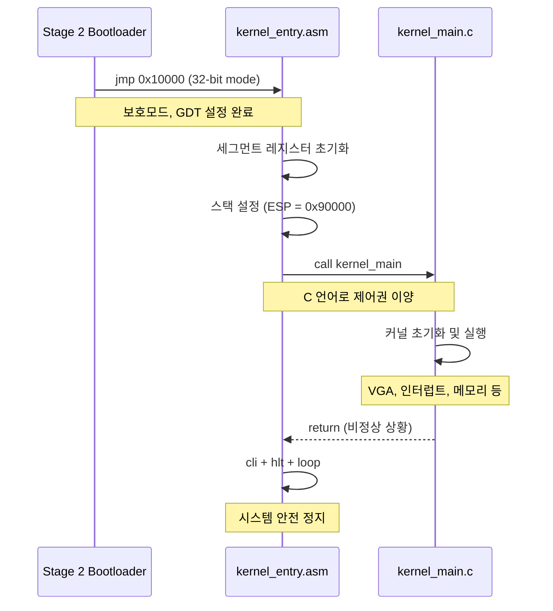
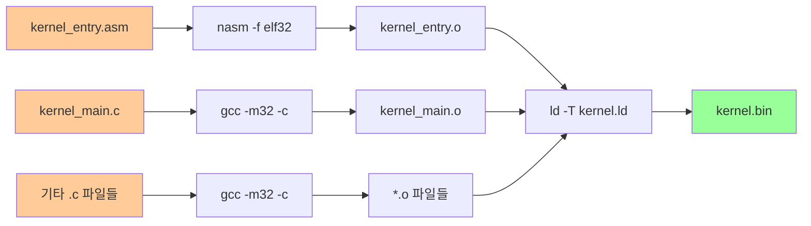

# 🔮 ChanUX Kernel System Documentation

## 📋 Overview

ChanUX 커널 시스템은 부트로더에서 넘겨받은 제어권을 통해 운영체제의 핵심 기능을 제공합니다. 이 문서는 커널 진입점(`kernel_entry.asm`)과 링커 스크립트(`kernel.ld`)의 구조와 동작을 상세히 설명합니다.

## 📁 Kernel Directory Structure

```
kernel/
├── kernel_entry.asm    # 커널 진입점 (32비트 어셈블리)
├── kernel.ld          # 링커 스크립트 (메모리 레이아웃 정의)
├── kernel_main.c      # C 커널 메인 함수
└── include/           # 헤더 파일들
    └── src/           # 소스 파일들
```

---

## 🔄 Kernel Initialization Flow

```mermaid
graph TD
    A[Stage 2 Bootloader<br/>jmp 0x10000] --> B[kernel_entry.asm<br/>_start 진입점]
    B --> C[세그먼트 레지스터<br/>초기화]
    C --> D[커널 스택 설정<br/>ESP = 0x90000]
    D --> E[call kernel_main<br/>C 함수 호출]
    E --> F[커널 주요 기능<br/>초기화 및 실행]
    F --> G[무한 루프<br/>(정상 동작)]
    
    E --> H[kernel_main 반환<br/>(비정상 상황)]
    H --> I[cli - 인터럽트 비활성화]
    I --> J[hlt - CPU 정지]
    J --> K[무한 루프<br/>(시스템 정지)]
    
    style A fill:#99ccff
    style B fill:#ffcc99
    style C fill:#ffcc99
    style D fill:#ffcc99
    style E fill:#99ff99
    style F fill:#99ff99
    style G fill:#99ff99
    style H fill:#ff9999
    style I fill:#ff9999
    style J fill:#ff9999
    style K fill:#ff9999
```

---

## 📄 Kernel Entry Point (`kernel_entry.asm`)

### 🎯 Primary Functions

| Function | Description | Technical Details |
|----------|-------------|-------------------|
| **Segment Setup** | 32비트 보호모드 세그먼트 초기화 | DS, ES, FS, GS, SS = 0x10 |
| **Stack Setup** | C 함수 호출을 위한 스택 설정 | ESP = 0x90000 (576KB) |
| **C Interface** | 어셈블리에서 C 언어로 제어권 이양 | call kernel_main |
| **Safety Halt** | 비정상 종료 시 시스템 안전 정지 | cli + hlt + loop |

### 🏗️ Memory Layout (Kernel Entry)

```
Physical Memory Address    Purpose                     State
┌─────────────────────┬──────────────────────────┬─────────────┐
│ 0x10000             │ _start (진입점)          │ 실행 중     │ ← 부트로더 jmp
├─────────────────────┼──────────────────────────┼─────────────┤
│ 0x10000 + offset    │ .text (코드 섹션)        │ 실행 가능   │
├─────────────────────┼──────────────────────────┼─────────────┤
│ 코드 끝 + offset    │ .rodata (읽기전용 데이터) │ 읽기 전용   │
├─────────────────────┼──────────────────────────┼─────────────┤
│ rodata 끝 + offset  │ .data (초기화된 데이터)   │ 읽기/쓰기   │
├─────────────────────┼──────────────────────────┼─────────────┤
│ data 끝 + offset    │ .bss (미초기화 데이터)    │ 0으로 초기화 │
├─────────────────────┼──────────────────────────┼─────────────┤
│ ~0x18000            │ 커널 끝 (__kernel_end)   │ 여유 공간   │
├─────────────────────┼──────────────────────────┼─────────────┤
│ 0x90000 ↓          │ 커널 스택 (아래로 성장)   │ 활성        │ ← ESP 시작점
└─────────────────────┴──────────────────────────┴─────────────┘
```

### 🔧 Key Operations

#### 1. 32비트 보호모드 세그먼트 설정
```asm
; 부트로더에서 설정한 GDT 사용
mov ax, 0x10        ; 데이터 세그먼트 셀렉터 (GDT 인덱스 2)
mov ds, ax          ; DS = 데이터 세그먼트
mov es, ax          ; ES = 추가 세그먼트  
mov fs, ax          ; FS = 추가 세그먼트
mov gs, ax          ; GS = 추가 세그먼트
mov ss, ax          ; SS = 스택 세그먼트
```

#### 2. 커널 스택 초기화
```asm
mov esp, 0x90000    ; 576KB 위치에 스택 포인터 설정
                    ; C 함수 호출, 지역변수, 리턴 주소용
```

#### 3. C 커널 호출 및 안전 정지
```asm
call kernel_main    ; C 언어 커널로 제어권 이양
cli                 ; 인터럽트 비활성화 (비정상 반환 시)
.loop:
    hlt             ; CPU 저전력 대기
    jmp .loop       ; 무한 루프
```

---

## 📄 Linker Script (`kernel.ld`)

### 🎯 Primary Functions

| Function | Description | Memory Impact |
|----------|-------------|---------------|
| **Entry Point** | 커널 실행 시작점 정의 | ENTRY(_start) |
| **Section Layout** | 코드/데이터 섹션 배치 규칙 | 연속 메모리 배치 |
| **Memory Mapping** | 물리 주소 매핑 정의 | 0x10000 시작 |
| **Symbol Export** | 커널 크기 추적용 심볼 | __kernel_end |

### 🏗️ Section Layout

```
Linker Script Sections    Physical Address    Purpose
┌─────────────────────┬─────────────────┬──────────────────────────┐
│ ENTRY(_start)       │ Link-time       │ 커널 진입점 정의          │
├─────────────────────┼─────────────────┼──────────────────────────┤
│ . = 0x10000        │ 0x10000         │ 로드 주소 설정 (64KB)     │
├─────────────────────┼─────────────────┼──────────────────────────┤
│ .text :             │ 0x10000+        │ 실행 코드 섹션            │
│   *(.text)          │                 │ - kernel_entry.o          │
│                     │                 │ - kernel_main.o           │
│                     │                 │ - 기타 .o 파일들          │
├─────────────────────┼─────────────────┼──────────────────────────┤
│ .rodata : ALIGN(4)  │ .text 끝+       │ 읽기 전용 데이터          │
│   *(.rodata)        │                 │ - 문자열 상수             │
│   *(.rodata.*)      │                 │ - const 변수들            │
├─────────────────────┼─────────────────┼──────────────────────────┤
│ .data : ALIGN(4)    │ .rodata 끝+     │ 초기화된 전역 변수        │
│   *(.data)          │                 │ - int global = 42;        │
│   *(.data.*)        │                 │ - 초기값 있는 데이터      │
├─────────────────────┼─────────────────┼──────────────────────────┤
│ .bss : ALIGN(4)     │ .data 끝+       │ 미초기화 전역 변수        │
│   __bss_start = .   │                 │ - int array[1000];        │
│   *(COMMON)         │                 │ - 0으로 자동 초기화       │
│   *(.bss)           │                 │                          │
│   __bss_end = .     │                 │                          │
├─────────────────────┼─────────────────┼──────────────────────────┤
│ __kernel_end = .    │ .bss 끝         │ 커널 전체 크기 표시       │
└─────────────────────┴─────────────────┴──────────────────────────┘
```

### 🔧 Key Configurations

#### 1. 출력 형식 및 아키텍처
```ld
OUTPUT_FORMAT(elf32-i386)    ; 32비트 ELF 형식
OUTPUT_ARCH(i386)            ; Intel x86 32비트 아키텍처
ENTRY(_start)                ; 진입점 심볼
```

#### 2. 메모리 레이아웃 최적화
```ld
. = 0x10000;                 ; 부트로더와 일치하는 로드 주소

.text : { *(.text) }         ; 코드 섹션 (연속 배치)
.rodata : ALIGN(4) { ... }   ; 4바이트 정렬 (CPU 효율성)
.data : ALIGN(4) { ... }     ; 초기화된 데이터
.bss : ALIGN(4) { ... }      ; 미초기화 데이터 (0 초기화)
```

#### 3. 심볼 정의
```ld
__bss_start = .;             ; BSS 섹션 시작 주소
__bss_end = .;               ; BSS 섹션 끝 주소  
__kernel_end = .;            ; 커널 전체 끝 주소
```

---

## 🔗 Boot-to-Kernel Handoff

### 정보 전달 과정



### 메모리 상태 전달

| 항목 | Stage 2 설정 | Kernel Entry 사용 |
|------|--------------|-------------------|
| **CPU 모드** | 32비트 보호모드 | 그대로 사용 |
| **GDT** | 기본 Code/Data 세그먼트 | 세그먼트 레지스터 초기화 |
| **A20** | 활성화됨 | 1MB+ 메모리 접근 가능 |
| **스택** | 0x90000 (32비트용) | ESP 재설정 |
| **커널** | 0x10000에 로드됨 | 해당 위치에서 실행 |

---

## 💾 Memory Safety & Layout

### 커널 메모리 보호

```
Memory Protection Zones:
┌─────────────────────────────────────────────────────────────┐
│ 0x00000 - 0x07FFF: 저메모리 영역 (32KB)                     │
│ ├─ BIOS 데이터, 인터럽트 벡터 테이블                         │
│ └─ 커널이 접근하지 않는 안전 영역                            │
├─────────────────────────────────────────────────────────────┤
│ 0x10000 - 0x18000: 커널 코드/데이터 영역 (~32KB)            │
│ ├─ .text: 실행 코드 (읽기/실행)                             │
│ ├─ .rodata: 상수 데이터 (읽기 전용)                         │
│ ├─ .data: 전역 변수 (읽기/쓰기)                             │
│ └─ .bss: 미초기화 데이터 (읽기/쓰기, 0 초기화)              │
├─────────────────────────────────────────────────────────────┤
│ 0x18000 - 0x8FFFF: 자유 메모리 영역 (~480KB)                │
│ ├─ 동적 메모리 할당 영역                                    │
│ ├─ 프로세스 메모리 공간                                     │
│ └─ 커널 확장 영역                                           │
├─────────────────────────────────────────────────────────────┤
│ 0x90000 - 0x9FFFF: 커널 스택 영역 (64KB)                   │
│ ├─ 함수 호출 스택                                           │
│ ├─ 지역 변수 저장                                           │
│ └─ 인터럽트 핸들러 스택                                     │
└─────────────────────────────────────────────────────────────┘
```

### 스택 안전성

```
Stack Growth Direction:
┌─────────────────────────────────────┐
│ 0x9FFFF: 스택 최대 크기 한계         │ ← 스택 오버플로 방지
├─────────────────────────────────────┤
│         ↑ 스택 성장 방향            │
│         │                          │
│ 함수 호출 프레임들                   │
│ - 리턴 주소                         │
│ - 함수 파라미터                     │
│ - 지역 변수                         │
│         │                          │
│         ↓                          │
├─────────────────────────────────────┤
│ 0x90000: ESP 초기값                 │ ← kernel_entry에서 설정
└─────────────────────────────────────┘
```

---

## 🔧 Build Process Integration

### 컴파일 및 링킹 과정



### 링커 명령어 예시

```bash
# 어셈블리 컴파일
nasm -f elf32 kernel/kernel_entry.asm -o build/kernel_entry.o

# C 파일 컴파일  
gcc -m32 -c kernel/kernel_main.c -o build/kernel_main.o

# 링킹 (kernel.ld 사용)
ld -T kernel/kernel.ld -m elf_i386 \
   build/kernel_entry.o \
   build/kernel_main.o \
   build/*.o \
   -o build/kernel.bin
```

---

## 🚨 Error Handling & Debugging

### 커널 레벨 오류 처리

| 오류 상황 | 감지 방법 | 처리 방식 |
|-----------|-----------|-----------|
| **스택 오버플로** | ESP < 0x90000 검사 | 패닉 메시지 + 시스템 정지 |
| **커널 메모리 손상** | 체크섬, 가드 페이지 | 메모리 덤프 + 재부팅 |
| **잘못된 함수 호출** | 리턴 주소 검증 | 스택 트레이스 + 정지 |
| **kernel_main 반환** | _start에서 감지 | CLI + HLT 무한루프 |

### 디버깅 도구

#### 1. 메모리 덤프 함수
```c
void debug_memory_dump(void* addr, size_t size) {
    // 메모리 내용을 VGA에 16진수로 출력
    // 커널 상태 분석용
}
```

#### 2. 스택 트레이스
```c
void debug_stack_trace(void) {
    // EBP 체인을 따라 함수 호출 스택 추적
    // 함수 반환 주소들을 출력
}
```

#### 3. 커널 심볼 정보
```bash
# 커널 바이너리에서 심볼 정보 추출
objdump -t build/kernel.bin | grep -E "(kernel_end|bss_start)"
```

---

## 🔍 Advanced Features

### 1. 동적 메모리 관리 준비

```c
extern char __kernel_end;    // 링커 스크립트에서 정의
void* heap_start = &__kernel_end;  // 힙 시작점
void* heap_end = (void*)0x90000;   // 힙 끝점 (스택 시작 전)
```

### 2. BSS 섹션 초기화

```c
extern char __bss_start, __bss_end;

void clear_bss(void) {
    char* bss = &__bss_start;
    while (bss < &__bss_end) {
        *bss++ = 0;
    }
}
```

### 3. 커널 정보 구조체

```c
typedef struct {
    void* kernel_start;     // 0x10000
    void* kernel_end;       // __kernel_end
    size_t kernel_size;     // 커널 전체 크기
    void* heap_start;       // 동적 메모리 시작
    void* stack_base;       // 0x90000
} kernel_info_t;
```

---

## 📚 Technical Specifications

### 메모리 레이아웃 상수

| 상수 | 값 | 용도 |
|------|----|----- |
| `KERNEL_LOAD_ADDR` | 0x10000 | 커널 로드 주소 |
| `KERNEL_STACK_BASE` | 0x90000 | 스택 기준점 |
| `KERNEL_MAX_SIZE` | 0x8000 | 최대 커널 크기 (32KB) |
| `HEAP_START` | `__kernel_end` | 동적 메모리 시작 |
| `HEAP_MAX_SIZE` | ~480KB | 사용 가능한 힙 크기 |

### GDT 세그먼트 구조

```
GDT Index    Selector    Description
┌─────────┬─────────┬──────────────────────────────┐
│ 0       │ 0x00    │ Null Descriptor (필수)       │
├─────────┼─────────┼──────────────────────────────┤
│ 1       │ 0x08    │ Code Segment (커널 코드)      │
├─────────┼─────────┼──────────────────────────────┤
│ 2       │ 0x10    │ Data Segment (커널 데이터)    │ ← kernel_entry에서 사용
└─────────┴─────────┴──────────────────────────────┘
```

### 함수 호출 규약 (cdecl)

```
Stack Frame Layout:
┌─────────────────────────────────┐ ← 높은 주소
│ 함수 파라미터 N                  │
│ 함수 파라미터 2                  │  
│ 함수 파라미터 1                  │
├─────────────────────────────────┤
│ 리턴 주소 (call 다음 명령어)      │ ← call 명령어가 push
├─────────────────────────────────┤
│ 이전 EBP (백업)                 │ ← 함수 프롤로그에서 push ebp
├─────────────────────────────────┤ ← EBP 위치 (mov ebp, esp)
│ 지역 변수들                     │
│         ...                     │
├─────────────────────────────────┤ ← ESP 위치 (현재 스택 톱)
│ (스택 확장 공간)                 │
└─────────────────────────────────┘ ← 낮은 주소
```

---

## 🎯 Performance Considerations

### 1. 메모리 정렬 최적화

- **4바이트 정렬**: CPU 캐시 효율성 향상
- **연속 배치**: 페이지 폴트 최소화
- **섹션 분리**: 코드/데이터 보호 강화

### 2. 스택 크기 최적화

- **64KB 스택**: 깊은 함수 호출 지원
- **스택 가드**: 오버플로 감지 및 방지
- **인터럽트 스택**: 별도 스택으로 안전성 확보

### 3. 커널 크기 제한

- **32KB 제한**: 부트로더 호환성 유지
- **섹션 최적화**: 불필요한 패딩 제거
- **코드 압축**: 중복 코드 제거 및 최적화

---

*이 문서는 ChanUX 운영체제의 커널 시스템 구조와 동작 원리를 완전히 다룹니다. 부트로더에서 커널로의 안전한 제어권 이양과 효율적인 메모리 레이아웃을 통해 안정적인 커널 환경을 제공합니다.*
