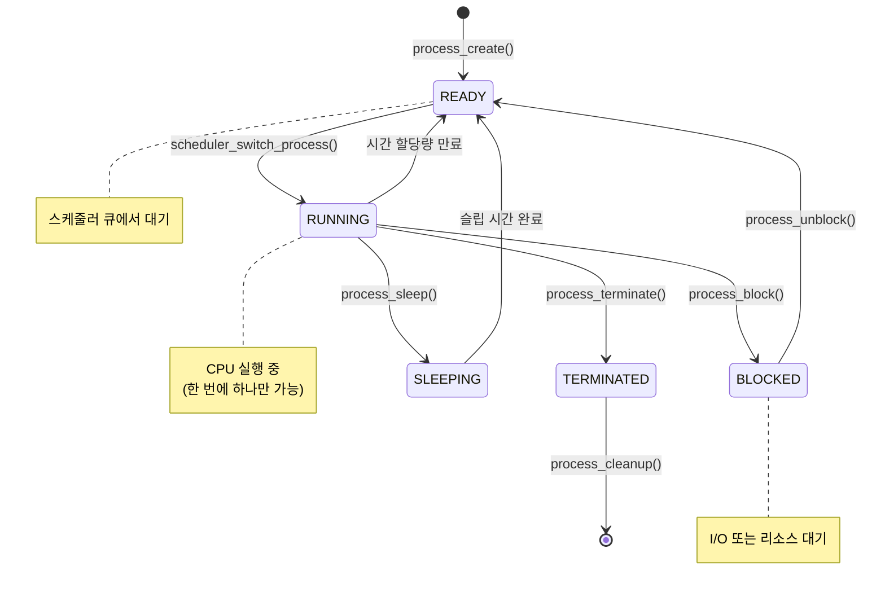
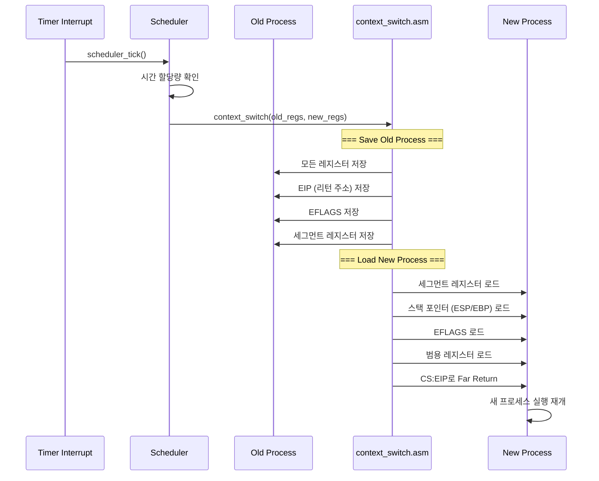
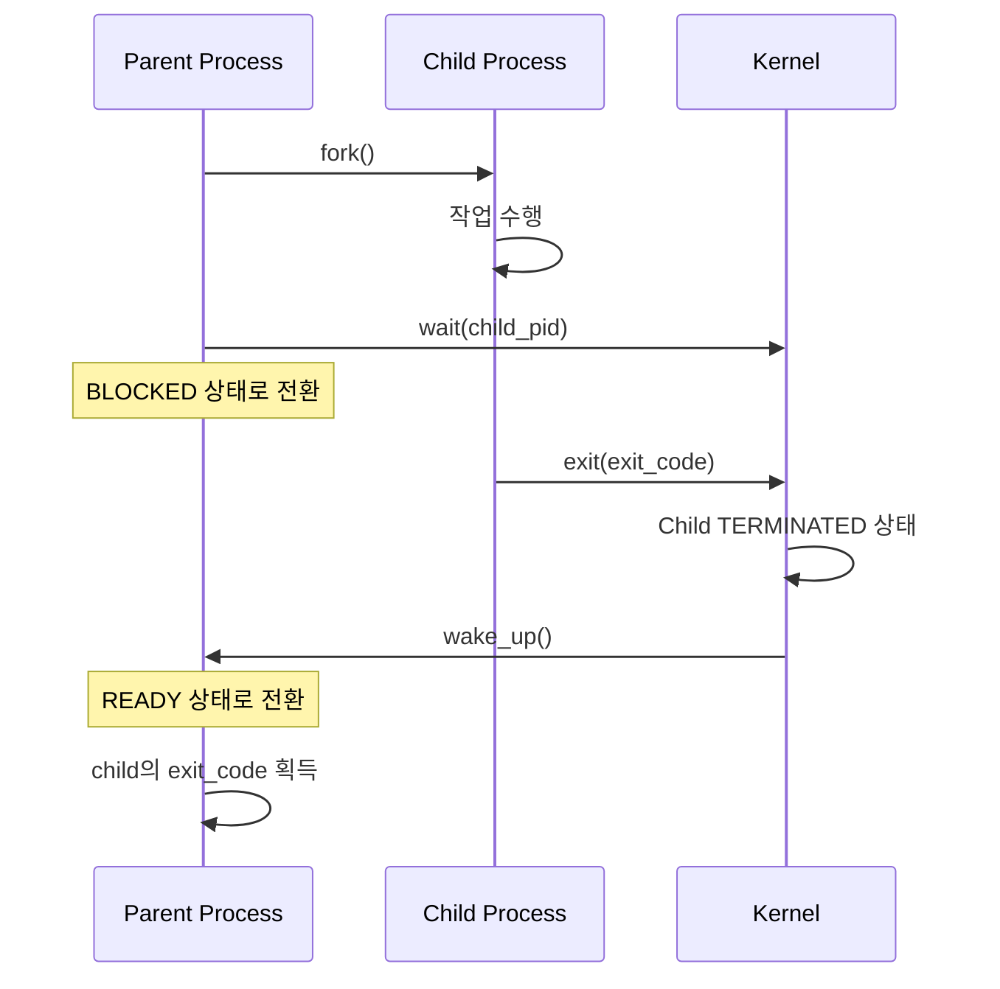

# ⚙️ ChanUX Process Management System Documentation

## 📋 Overview

ChanUX 프로세스 관리 시스템은 멀티태스킹 운영체제의 핵심 기능을 제공합니다. 이 문서는 프로세스 생성, 스케줄링, 컨텍스트 스위칭의 구조와 동작을 상세히 설명합니다.

## 📁 Process Management Structure

```
kernel/src/process/
├── process.c          # 프로세스 관리 핵심 로직
├── context_switch.asm # 저수준 컨텍스트 스위칭
└── process.h          # 프로세스 구조체 및 인터페이스
```

---

## 🔄 Process Lifecycle Flow



---

## 📄 Process Structure (`process.c`)

### 🎯 Core Data Structures

#### Process Control Block (PCB)
```c
typedef struct process {
    pid_t pid;                    // 프로세스 ID
    pid_t parent_pid;             // 부모 프로세스 ID
    char name[32];                // 프로세스 이름
    process_state_t state;        // 현재 상태
    process_priority_t priority;  // 우선순위
    
    process_regs_t regs;          // CPU 레지스터 상태
    uint32_t stack_base;          // 스택 시작 주소
    uint32_t stack_size;          // 스택 크기
    uint32_t heap_base;           // 힙 시작 주소
    uint32_t heap_size;           // 힙 크기
    
    uint32_t creation_time;       // 생성 시간
    uint32_t cpu_time;            // CPU 사용 시간
    uint32_t sleep_until;         // 슬립 종료 시간
    
    struct process* parent;       // 부모 프로세스 포인터
    struct process* next;         // 큐에서 다음 프로세스
    struct process* prev;         // 큐에서 이전 프로세스
} process_t;
```

#### Scheduler Structure
```c
typedef struct {
    process_t* current_process;    // 현재 실행 중인 프로세스
    process_t* ready_queue_head;   // 준비 큐 헤드
    process_t* ready_queue_tail;   // 준비 큐 테일
    process_t* sleeping_queue;     // 슬립 큐
    uint32_t num_processes;        // 총 프로세스 수
    uint32_t scheduler_ticks;      // 스케줄러 틱 카운터
    bool preemption_enabled;       // 선점 스케줄링 활성화
} scheduler_t;
```

### 🏗️ Memory Layout

```
Process Memory Space (Per Process):
┌─────────────────────────────────────────────────────────────┐
│ Stack Area (4KB per process)                                │
│ ┌─────────────────────────────────────────────────────────┐ │ ← 높은 주소
│ │ Stack Top (ESP 초기값)                                  │ │
│ │ ├─ 함수 파라미터                                        │ │
│ │ ├─ 리턴 주소                                            │ │
│ │ ├─ 지역 변수                                            │ │
│ │ └─ 저장된 레지스터                                      │ │
│ │         ↓ (스택 성장 방향)                              │ │
│ └─────────────────────────────────────────────────────────┘ │ ← stack_base
├─────────────────────────────────────────────────────────────┤
│ Process Control Block (PCB)                                 │
│ ├─ PID, 상태, 우선순위                                      │
│ ├─ CPU 레지스터 백업                                        │
│ ├─ 메모리 정보                                              │
│ └─ 스케줄링 정보                                            │
├─────────────────────────────────────────────────────────────┤
│ Heap Area (동적 할당 영역)                                  │
│ ├─ malloc(), free() 관리                                    │
│ └─ 프로세스별 동적 메모리                                   │
└─────────────────────────────────────────────────────────────┘ ← 낮은 주소
```

### 🔧 Key Functions

#### 1. Process Creation
```c
process_t* process_create(const char* name, 
                         void (*entry_point)(void), 
                         process_priority_t priority)
```

**생성 과정:**
1. **슬롯 검색**: 프로세스 테이블에서 빈 슬롯 찾기
2. **PCB 초기화**: PID, 상태, 우선순위 설정
3. **메모리 할당**: 4KB 스택 공간 할당
4. **레지스터 설정**: 초기 CPU 상태 구성
5. **스케줄러 등록**: 준비 큐에 추가

#### 2. Process Scheduling
```c
void scheduler_switch_process(void)
```

**스케줄링 알고리즘:** Round-Robin
- **시간 할당량**: 10 타이머 틱
- **큐 관리**: FIFO 방식 준비 큐
- **우선순위**: 향후 확장 가능

#### 3. Process States Management
```c
// 상태 전환 함수들
void process_block(process_t* process);      // RUNNING → BLOCKED
void process_unblock(process_t* process);    // BLOCKED → READY
void process_sleep(process_t* process, uint32_t ms);  // RUNNING → SLEEPING
void process_wake_up(process_t* process);    // SLEEPING → READY
```

---

## 📄 Context Switching (`context_switch.asm`)

### 🎯 Primary Functions

| Function | Description | CPU Impact |
|----------|-------------|------------|
| **Register Save** | 현재 프로세스의 모든 레지스터 백업 | ~20 cycles |
| **Register Load** | 새 프로세스의 레지스터 복원 | ~20 cycles |
| **Stack Switch** | ESP/EBP 스택 포인터 변경 | ~5 cycles |
| **Segment Load** | 세그먼트 레지스터 업데이트 | ~10 cycles |

### 🏗️ Register Structure

```c
typedef struct {
    uint32_t eax, ebx, ecx, edx;    // 범용 레지스터
    uint32_t esi, edi;              // 인덱스 레지스터
    uint32_t esp, ebp;              // 스택 포인터
    uint32_t eip;                   // 명령어 포인터
    uint32_t eflags;                // 플래그 레지스터
    uint16_t cs, ds, es, fs, gs, ss; // 세그먼트 레지스터
} process_regs_t;
```

### 🔧 Context Switch Process



#### 1. Register Saving (Old Process)
```asm
; Save current process state to old_regs
mov [eax + 0], eax      ; Save EAX
mov [eax + 4], ebx      ; Save EBX
mov [eax + 8], ecx      ; Save ECX  
mov [eax + 12], edx     ; Save EDX
mov [eax + 16], esi     ; Save ESI
mov [eax + 20], edi     ; Save EDI
mov [eax + 24], esp     ; Save ESP
mov [eax + 28], ebp     ; Save EBP
```

#### 2. Execution Point Saving
```asm
; Save EIP (return address)
mov ecx, [esp]          ; Get return address from stack
mov [eax + 32], ecx     ; Save EIP

; Save EFLAGS
pushfd                  ; Push EFLAGS onto stack
pop ecx                 ; Pop into ECX
mov [eax + 36], ecx     ; Save EFLAGS
```

#### 3. Register Loading (New Process)
```asm
; Load new process state from new_regs
mov cx, [ebx + 42]      ; Load DS
mov ds, cx
mov esp, [ebx + 24]     ; Load ESP
mov ebp, [ebx + 28]     ; Load EBP

; Load general purpose registers
mov eax, [ebx + 0]      ; Load EAX
mov ecx, [ebx + 8]      ; Load ECX
mov edx, [ebx + 12]     ; Load EDX
```

#### 4. Execution Transfer
```asm
; Far return to new process
push dword [ebx + 40]   ; Push CS
push dword [ebx + 32]   ; Push EIP
mov ebx, [ebx + 4]      ; Load EBX last
retf                    ; Far return (CS:EIP)
```

---

## 🔄 Scheduler Algorithms

### Round-Robin Scheduling

```mermaid
graph LR
    subgraph "Ready Queue (FIFO)"
        P1[Process A<br/>Priority: High]
        P2[Process B<br/>Priority: Normal]
        P3[Process C<br/>Priority: Low]
        P4[Process D<br/>Priority: Normal]
    end
    
    subgraph "CPU"
        CPU[Currently Running<br/>Process A]
    end
    
    subgraph "Other States"
        SLEEP[Sleeping Queue<br/>Process E, F]
        BLOCK[Blocked Queue<br/>Process G]
    end
    
    P1 --> P2
    P2 --> P3
    P3 --> P4
    P4 --> |Next| P1
    
    CPU --> |Time Quantum Expired| P2
    SLEEP --> |Wake Up| P4
    BLOCK --> |Unblock| P4
    
    style CPU fill:#99ff99
    style SLEEP fill:#ffcc99
    style BLOCK fill:#ff9999
```

### Scheduling Decisions

| 상황 | 동작 | 알고리즘 |
|------|------|----------|
| **Time Quantum 만료** | 현재 프로세스를 큐 끝으로 이동 | Round-Robin |
| **I/O 대기** | BLOCKED 상태로 전환, 큐에서 제거 | Event-driven |
| **Sleep 호출** | SLEEPING 상태, 타이머 기반 관리 | Time-based |
| **우선순위** | 현재는 무시, 향후 Priority Queue 도입 예정 | Future Enhancement |

---

## 💾 Memory Management

### Process Memory Allocation

```c
// 간단한 정적 메모리 할당 (현재 구현)
static uint8_t process_memory[MAX_PROCESSES * 8192]; // 8KB per process
static uint32_t memory_offset = 0;

void* process_allocate_memory(process_t* process, size_t size) {
    if (memory_offset + size > sizeof(process_memory)) {
        return NULL; // Out of memory
    }
    
    void* ptr = &process_memory[memory_offset];
    memory_offset += size;
    return ptr;
}
```

### Stack Layout per Process

```
Process Stack (4KB each):
┌─────────────────────────────────────────┐ ← stack_base + stack_size
│ Stack Top (ESP 초기값)                   │
├─────────────────────────────────────────┤
│ Function Call Frame N                   │
│ ├─ Local Variables                      │
│ ├─ Saved Registers                      │
│ └─ Return Address                       │
├─────────────────────────────────────────┤
│ Function Call Frame N-1                 │
│ ├─ Parameters                           │
│ ├─ Local Variables                      │
│ └─ Return Address                       │
├─────────────────────────────────────────┤
│              ...                        │
├─────────────────────────────────────────┤
│ Initial Stack Frame                     │
│ ├─ Entry Point Parameters               │
│ └─ Process Entry Point                  │ ← entry_point()
└─────────────────────────────────────────┘ ← stack_base
```

---

## ⏰ Timer Integration

### Scheduler Tick Processing

```mermaid
graph TD
    A[Timer Interrupt<br/>PIT 10ms] --> B[scheduler_tick()]
    B --> C[scheduler_ticks++]
    C --> D[Update Sleeping Processes]
    D --> E[Update Current Process<br/>CPU Time]
    E --> F{Preemption Enabled?}
    F -->|Yes| G{Time Quantum<br/>Expired?}
    F -->|No| H[Continue Current Process]
    G -->|Yes, 10 ticks| I[scheduler_switch_process()]
    G -->|No| H
    I --> J[Context Switch to<br/>Next Ready Process]
    
    style A fill:#ffcc99
    style I fill:#99ccff
    style J fill:#99ff99
```

### Sleep Management

```c
static void scheduler_update_sleeping_processes(void) {
    uint32_t current_time = timer_get_ticks();
    process_t* process = scheduler.sleeping_queue;
    
    while (process) {
        process_t* next = process->next;
        
        if (current_time >= process->sleep_until) {
            process_wake_up(process); // SLEEPING → READY
        }
        
        process = next;
    }
}
```

---

## 🚀 Process Creation Details

### Stack Initialization

```c
static void process_setup_stack(process_t* process, void (*entry_point)(void)) {
    memset(&process->regs, 0, sizeof(process_regs_t));
    
    // Set initial register values
    process->regs.eip = (uint32_t)entry_point;  // 진입점 설정
    process->regs.esp = process->stack_base + process->stack_size - 4;
    process->regs.ebp = process->regs.esp;
    process->regs.eflags = 0x202; // IF (Interrupt Flag) 활성화
    
    // Kernel mode segments
    process->regs.cs = 0x08; // Kernel code segment
    process->regs.ds = 0x10; // Kernel data segment
    process->regs.es = 0x10;
    process->regs.fs = 0x10;
    process->regs.gs = 0x10;
    process->regs.ss = 0x10; // Kernel stack segment
}
```

### Process Tree Structure

```
Process Hierarchy:
┌─────────────────────────────────────────┐
│ Kernel (PID 0)                          │
│ └─ init (PID 1) - idle process          │
│    ├─ Process A (PID 2)                 │
│    │  ├─ Child A1 (PID 5)               │
│    │  └─ Child A2 (PID 6)               │
│    ├─ Process B (PID 3)                 │
│    │  └─ Child B1 (PID 7)               │
│    └─ Process C (PID 4)                 │
│       ├─ Child C1 (PID 8)               │
│       └─ Child C2 (PID 9)               │
└─────────────────────────────────────────┘
```

---

## 🔧 Inter-Process Communication

### Fork Implementation

```c
process_t* process_fork(process_t* parent) {
    // Create child with same properties
    char child_name[32];
    strcpy(child_name, parent->name);
    strcat(child_name, "_child");
    
    process_t* child = process_create(child_name, NULL, parent->priority);
    
    // Copy parent's register state
    memcpy(&child->regs, &parent->regs, sizeof(process_regs_t));
    
    // Fork return values
    child->regs.eax = 0;         // Child gets 0
    parent->regs.eax = child->pid; // Parent gets child PID
    
    return child;
}
```

### Wait/Exit Mechanism



---

## 🛡️ Process Security & Safety

### Memory Protection

| 보호 영역 | 접근 권한 | 보호 방법 |
|-----------|-----------|-----------|
| **Code Segment** | 읽기/실행 | GDT 세그먼트 설정 |
| **Data Segment** | 읽기/쓰기 | GDT 세그먼트 설정 |
| **Stack** | 읽기/쓰기 | 프로세스별 분리 |
| **다른 프로세스 메모리** | 접근 불가 | 주소 공간 분리 |

### Error Handling

```c
// Process creation failure
if (slot == -1) {
    terminal_writeline("ERROR: No free process slots available");
    return NULL;
}

// Memory allocation failure
if (!process->stack_base) {
    terminal_writeline("ERROR: Failed to allocate stack memory");
    process_slots_used[slot] = false;
    return NULL;
}

// Context switch safety
if (!new_process) {
    terminal_writeline("WARNING: No process to switch to, continuing current");
    return;
}
```

---

## 🔍 Debugging & Monitoring

### Process Information Display

```c
void process_print_info(process_t* process) {
    terminal_writestring("Process: "); terminal_writeline(process->name);
    terminal_writestring("  PID: "); /* PID 출력 */
    terminal_writestring("  Parent PID: "); /* 부모 PID 출력 */
    terminal_writestring("  State: ");
    
    switch (process->state) {
        case PROCESS_STATE_READY:      terminal_writeline("READY"); break;
        case PROCESS_STATE_RUNNING:    terminal_writeline("RUNNING"); break;
        case PROCESS_STATE_BLOCKED:    terminal_writeline("BLOCKED"); break;
        case PROCESS_STATE_SLEEPING:   terminal_writeline("SLEEPING"); break;
        case PROCESS_STATE_TERMINATED: terminal_writeline("TERMINATED"); break;
    }
    
    terminal_writestring("  CPU Time: "); /* CPU 시간 출력 */
}
```

### Performance Metrics

| 메트릭 | 측정 방법 | 용도 |
|--------|-----------|------|
| **Context Switch Time** | TSC 레지스터 사용 | 스케줄러 성능 분석 |
| **CPU Utilization** | process->cpu_time 추적 | 프로세스별 리소스 사용량 |
| **Ready Queue Length** | scheduler.num_processes | 시스템 부하 측정 |
| **Memory Usage** | 스택/힙 사용량 추적 | 메모리 누수 감지 |

---

## 🚨 Known Limitations & Future Enhancements

### Current Limitations

1. **메모리 관리**: 단순한 정적 할당, 가상 메모리 미지원
2. **스케줄링**: Round-Robin만 지원, 우선순위 스케줄링 미구현
3. **IPC**: 기본적인 fork/wait만 지원
4. **파일 시스템**: 프로세스별 파일 디스크립터 테이블 없음

### Planned Enhancements

```mermaid
roadmap
    title Process Management Roadmap
    
    section Current (v1.0)
        Basic Round-Robin     : done, basic-rr, 2024-01-01, 30d
        Context Switching     : done, context, 2024-01-15, 15d
        Fork/Wait/Exit       : done, fork-wait, 2024-02-01, 20d
    
    section Phase 2 (v2.0)
        Priority Scheduling   : active, priority, 2024-03-01, 25d
        Virtual Memory       : virtual-mem, 2024-03-15, 40d
        Signal Handling      : signals, 2024-04-01, 20d
    
    section Phase 3 (v3.0)
        User Mode Processes  : user-mode, 2024-05-01, 30d
        Pipe IPC            : pipes, 2024-05-15, 25d
        Thread Support      : threads, 2024-06-01, 35d
```

---

## 📚 Technical References

### Assembly Language Context Switching

- **PUSHFD/POPFD**: EFLAGS 레지스터 저장/복원
- **RETF**: Far Return (CS:EIP 동시 로드)
- **Segment Register Loading**: 보호모드 세그먼트 스위칭

### C Language Process Management

- **Structure Alignment**: 메모리 효율성을 위한 구조체 정렬
- **Function Pointers**: entry_point 콜백을 통한 프로세스 시작
- **Linked Lists**: 스케줄러 큐 관리

### Memory Layout Considerations

- **Stack Direction**: x86에서 스택은 높은 주소에서 낮은 주소로 성장
- **Alignment**: 4바이트 정렬로 CPU 성능 최적화
- **Segmentation**: GDT 기반 메모리 보호

---

*이 문서는 ChanUX 운영체제의 프로세스 관리 시스템을 완전히 다룹니다. 하드웨어 레벨의 컨텍스트 스위칭부터 고수준의 프로세스 생명주기 관리까지 모든 측면을 포괄합니다.*
